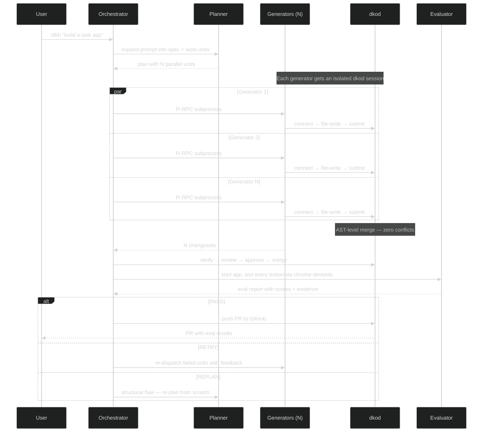

<p align="center">
  <a href="https://dkod.io">
    <picture>
      <source media="(prefers-color-scheme: dark)" srcset="https://raw.githubusercontent.com/dkod-io/dkod-engine/main/.github/assets/banner-dark.svg">
      
    </picture>
  </a>
</p>

<p align="center">
  <b>20 agents. One branch. Zero conflicts. Now in Pi.</b>
</p>

<p align="center">
  <a href="LICENSE"></a>
  <a href="https://github.com/dkod-io/pi-extension"></a>
  <a href="https://dkod.io"></a>
  <a href="https://discord.gg/q2xzuNDJ"></a>
</p>

<p align="center">
  <a href="https://dkod.io/docs">Documentation</a> &nbsp;&bull;&nbsp;
  <a href="#quick-start">Quick Start</a> &nbsp;&bull;&nbsp;
  <a href="https://github.com/dkod-io/harness">Harness</a> &nbsp;&bull;&nbsp;
  <a href="https://discord.gg/q2xzuNDJ">Discord</a>
</p>

<br>

## The Problem

Traditional AI agent workflows hit a wall: **Git becomes a bottleneck.**

You deploy 3 agents on the same repo. Agent A refactors auth. Agent B adds an endpoint. Agent C writes tests. They all finish in 2 minutes. Then you spend 45 minutes resolving merge conflicts.

Even worse — most tools serialize agents to avoid this. One agent at a time. One PR at a time. Sequential. Slow.

**AI agents are fast. Git-based workflows make them wait in line.**

## The Fix

[dkod](https://dkod.io) replaces the bottleneck — not the agents. This extension brings dkod to [Pi](https://github.com/badlogic/pi-mono):

- **Multiple agents from multiple users** work on the same functions, same files, same repository — simultaneously
- Each agent gets an **isolated session overlay** (copy-on-write, not a clone or worktree)
- Changes merge by **function, type, and import** — not by line
- PRs land with **zero conflicts** in under 60 seconds

The result: **24 minutes becomes 2 minutes. 4 conflicts becomes 0.**

<br>

<table>
<tr>
<td width="50%" valign="top">

### Session Isolation

Each agent gets its own overlay on top of the shared repo. Writes go to the overlay, reads fall through to the base. dkod uses AST-level symbol tracking (via tree-sitter) to understand exactly which functions, classes, and methods each agent touches.

**No clones. No worktrees. No locks. No waiting.**

10 agents editing simultaneously, each in their own sandbox.

</td>
<td width="50%" valign="top">

### AST-Level Semantic Merge

Forget line-based diffs. dkod detects conflicts at the **symbol level** — functions, types, constants.

Two agents editing different functions in the same file? **No conflict.** Merged in under 50ms.

Two agents rewriting the same function? Caught instantly, with a precise report — not a wall of `<<<<<<<` markers.

</td>
</tr>
<tr>
<td width="50%" valign="top">

### Verification Pipeline

Every changeset passes through **lint, type-check, and test** gates before it touches main. Automated code review with scoring on every submission.

Agents get structured failure data — not log dumps — so they fix issues and retry autonomously.

Average time from submission to verified merge: **under 30 seconds.**

</td>
<td width="50%" valign="top">

### Autonomous Build Pipeline

One prompt in. Working, tested PR out. Zero human interaction.

The [harness](https://github.com/dkod-io/harness) orchestrates: **Planner** decomposes work by symbol, **N Generators** implement in parallel via dkod sessions, **Evaluator** tests the live app via chrome-devtools.

Based on [Anthropic's Planner-Generator-Evaluator research](https://www.anthropic.com/engineering/harness-design-long-running-apps).

</td>
</tr>
</table>

<br>

## Quick Start

**Install**

```bash
# Install dk CLI
curl -fsSL https://dkod.io/install.sh | sh

# Authenticate
dk login

# Install the Pi extension
pi install npm:@dkod/pi
```

**Build something**

```
/dkh Build a project management webapp with kanban boards, team collaboration, and real-time updates
```

That's it. The harness does the rest.

<details>
<summary>&nbsp;<b>More commands</b></summary>

<br>

| Command | Description |
|---------|-------------|
| `/dkh <prompt>` | Full autonomous build — plan, build, land, eval, ship |
| `/dkh:plan <prompt>` | Planning only — produce spec + parallel work units |
| `/dkh:eval` | Evaluate current application against criteria |
| `/dkod:config` | Verify dk CLI installation and authentication |

</details>

<br>

## How It Works



<br>

## Why dkod, Not Git Worktrees?

| | Git worktrees | dkod sessions |
|---|---|---|
| **Setup per agent** | Full clone or worktree (~seconds) | Copy-on-write overlay (~ms) |
| **Merge strategy** | Line-based diff (conflicts on same file) | AST-level symbol merge (conflicts only on same function) |
| **10 agents, same file** | 10 worktrees, manual conflict resolution | 10 overlays, automatic merge |
| **Merge time** | Minutes + human review | Under 50ms, automated |
| **Verification** | Manual CI pipeline | Built-in lint + type-check + test + code review |
| **Disk usage** | Full copy per agent | Overlay only (changed symbols) |

<br>

## Architecture

```
pi-extension/
├── src/
│   ├── index.ts              Extension entry — registers commands + guard
│   ├── guard.ts              Runtime tool blocker (Write/Edit/git blocked)
│   ├── parallel.ts           RPC subprocess manager (N generators)
│   ├── commands/
│   │   ├── dkh.ts            /dkh — full autonomous pipeline
│   │   ├── plan.ts           /dkh:plan — planning only
│   │   ├── eval.ts           /dkh:eval — evaluate current app
│   │   └── config.ts         /dkod:config — verify setup
│   └── prompts/
│       ├── orchestrator.md   Drives the autonomous loop
│       ├── planner.md        Prompt → spec → parallel work units
│       ├── generator.md      Implements one unit per dkod session
│       └── evaluator.md      Adversarial testing via chrome-devtools
└── skills/dkh/
    └── SKILL.md              Pi skill definition
```

**Key design decisions:**

- **dk CLI** (`--json` mode) is the sole dkod interface — no HTTP client, no custom tool wrappers
- **Runtime tool enforcement** via Pi's `tool_call` event — generators are blocked from using Write/Edit/Bash-file-writes at the runtime level, not just prompt instructions
- **Pi RPC subprocesses** give true OS-level parallelism for generators — each subprocess is a full Pi instance with its own dkod session
- **Agent prompts** adapted from the [dkod harness](https://github.com/dkod-io/harness) for Pi + dk CLI syntax

<br>

## Prerequisites

<p>
  <kbd>&nbsp; Pi TUI &nbsp;</kbd>&nbsp;
  <kbd>&nbsp; dk CLI v0.2.69+ &nbsp;</kbd>&nbsp;
  <kbd>&nbsp; Chrome DevTools &nbsp;</kbd>
</p>

<br>

## Inspired By

- [dkod: Agent-native code platform](https://dkod.io) — session isolation + AST merge for AI agents
- [dkod harness: Autonomous Planner-Generator-Evaluator pipeline](https://github.com/dkod-io/harness)
- [Anthropic: Harness design for long-running application development](https://www.anthropic.com/engineering/harness-design-long-running-apps)
- [Pi: Terminal AI agent](https://github.com/badlogic/pi-mono)

<br>

## License

MIT — free to use, fork, and build on.

<br>

<p align="center">
  <sub>Built for the age of agent-native development &bull; <a href="https://dkod.io">dkod.io</a></sub>
</p>
