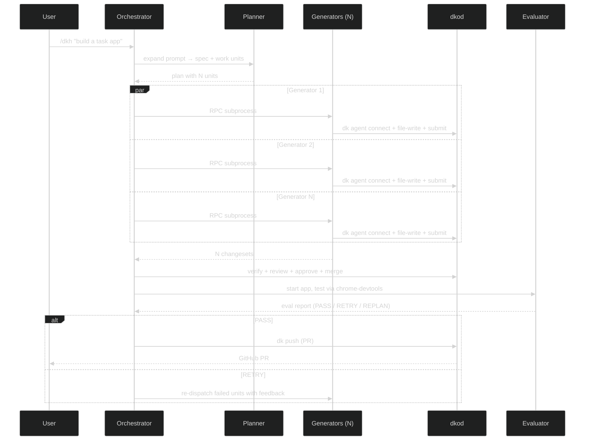

<p align="center">
  <a href="https://dkod.io">
    <picture>
      <source media="(prefers-color-scheme: dark)" srcset="https://raw.githubusercontent.com/dkod-io/dkod-engine/main/.github/assets/banner-dark.svg">
      
    </picture>
  </a>
</p>

<p align="center">
  <b>dkod for Pi — one prompt in, working tested PR out.</b>
</p>

<p align="center">
  <a href="LICENSE"></a>
  <a href="https://github.com/dkod-io/pi-extension"></a>
  <a href="https://dkod.io"></a>
  <a href="https://discord.gg/q2xzuNDJ"></a>
</p>

<p align="center">
  <a href="https://dkod.io/docs">Documentation</a> &nbsp;&bull;&nbsp;
  <a href="#quick-start">Quick Start</a> &nbsp;&bull;&nbsp;
  <a href="https://github.com/dkod-io/harness">Harness</a> &nbsp;&bull;&nbsp;
  <a href="https://discord.gg/q2xzuNDJ">Discord</a>
</p>

<br>

## The Problem

You ask an AI agent to build a full-stack app. It works for 45 minutes. Sequentially. One file at a time. One function at a time.

**AI agents are capable. Your tooling makes them slow.**

## The Fix

This extension brings [dkod](https://dkod.io)'s parallel agent execution to [Pi](https://github.com/badlogic/pi-mono). N generators implement your app simultaneously — each in its own isolated dkod session. dkod's AST-level merge eliminates conflicts. The result: what took 45 minutes now takes 10.

<br>

<table>
<tr>
<td width="50%" valign="top">

### Parallel Generators

N Pi RPC subprocesses, each with its own dkod session. All writing code at the same time. Two agents editing different functions in the same file? **No conflict.**

dkod merges at the symbol level — functions, types, classes — not lines.

</td>
<td width="50%" valign="top">

### Adversarial Evaluation

A skeptical evaluator that actually starts the app, clicks every button, fills every form. Scores each criterion with evidence (screenshots, console output).

Defaults to FAIL unless proven PASS.

</td>
</tr>
<tr>
<td width="50%" valign="top">

### Runtime Tool Guard

Write, Edit, and Bash file-writes are **blocked at runtime** during generator sessions — enforced via Pi's `tool_call` event hook, not just prompt instructions.

Generators must use `dk --json agent file-write`. No workarounds.

</td>
<td width="50%" valign="top">

### Autonomous Pipeline

Plan. Build. Land. Eval. Ship. Zero human interaction. The harness makes every decision autonomously — framework choice, conflict resolution, fix rounds.

Based on [Anthropic's Planner-Generator-Evaluator research](https://www.anthropic.com/engineering/harness-design-long-running-apps).

</td>
</tr>
</table>

<br>

## Quick Start

**Install**

```bash
# Install dk CLI
curl -fsSL https://dkod.io/install.sh | sh

# Authenticate
dk login

# Install the Pi extension
pi install npm:@dkod/pi
```

**Build something**

```
/dkh Build a project management webapp with kanban boards, team collaboration, and real-time updates
```

That's it. The harness does the rest.

<details>
<summary>&nbsp;<b>More commands</b></summary>

<br>

```bash
# Plan only (review before building)
/dkh:plan Build a recipe sharing platform with user profiles and ingredient search

# Evaluate existing code
/dkh:eval

# Check setup (verify dk CLI + auth)
/dkod:config
```

</details>

<br>

## How It Works



<br>

## Architecture

```
pi-extension/
├── src/
│   ├── index.ts              Extension entry — registers commands + guard
│   ├── guard.ts              Runtime tool blocker (Write/Edit/git → blocked)
│   ├── parallel.ts           RPC subprocess manager (N generators)
│   ├── commands/
│   │   ├── dkh.ts            /dkh — full autonomous pipeline
│   │   ├── plan.ts           /dkh:plan — planning only
│   │   ├── eval.ts           /dkh:eval — evaluate current app
│   │   └── config.ts         /dkod:config — verify setup
│   └── prompts/
│       ├── orchestrator.md   Drives the autonomous loop
│       ├── planner.md        Prompt → spec → parallel work units
│       ├── generator.md      Implements one unit per dkod session
│       └── evaluator.md      Adversarial testing via chrome-devtools
└── skills/dkh/
    └── SKILL.md              Pi skill definition
```

**Key design decisions:**

- **dk CLI** (`--json` mode) is the sole dkod interface — no HTTP client, no custom tool wrappers
- **Pi RPC subprocesses** give true OS-level parallelism for generators
- **Runtime enforcement** via `tool_call` event — not just prompt instructions
- **Agent prompts** adapted from the [dkod harness](https://github.com/dkod-io/harness) for Pi + dk CLI syntax

<br>

## Prerequisites

<p>
  <kbd>&nbsp; Pi TUI &nbsp;</kbd>&nbsp;
  <kbd>&nbsp; dk CLI v0.2.69+ &nbsp;</kbd>&nbsp;
  <kbd>&nbsp; Chrome DevTools &nbsp;</kbd>
</p>

<br>

## Inspired By

- [dkod: Agent-native code platform](https://dkod.io)
- [dkod harness: Autonomous Planner-Generator-Evaluator pipeline](https://github.com/dkod-io/harness)
- [Anthropic: Harness design for long-running application development](https://www.anthropic.com/engineering/harness-design-long-running-apps)
- [Pi: Terminal AI agent](https://github.com/badlogic/pi-mono)

<br>

## License

MIT — free to use, fork, and build on.

<br>

<p align="center">
  <sub>Built for the age of agent-native development &bull; <a href="https://dkod.io">dkod.io</a></sub>
</p>
